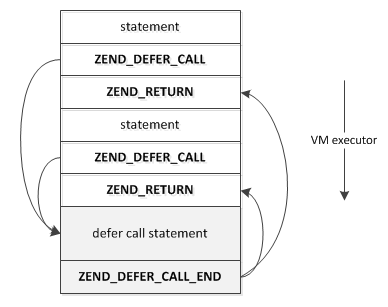
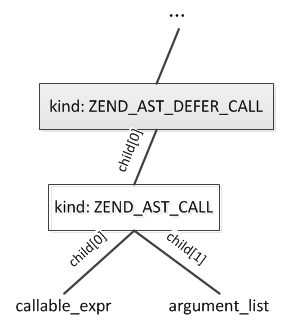

# 附录2：defer推迟执行语法的实现

使用过Go语言的应该都知道defer这个语法，它用来推迟一个函数的执行，在函数执行返回前首先检查当前函数内是否有推迟执行的函数，如果有则执行，然后再返回。defer是一个非常有用的语法，这个功能可以很方便的在函数结束前执行一些清理工作，比如关闭打开的文件、关闭连接、释放资源、解锁等等。这样延迟一个函数有以下两个好处：

* (1) 靠近使用位置，避免漏掉清理工作，同时比放在函数结尾要清晰
* (2) 如果有多处返回的地方可以避免代码重复，比如函数中有很多处return

在一个函数中可以使用多个defer，其执行顺序与栈类似：后进先出，先定义的defer后执行。另外，在返回之后定义的defer将不会被执行，只有返回前定义的才会执行，通过exit退出程序的情况也不会执行任何defer。

在PHP中并没有实现类似的语法，本节我们将尝试在PHP中实现类似Go语言中defer的功能。此功能的实现需要对PHP的语法解析、抽象语法树/opcode的编译、opcode指令的执行等环节进行改造，涉及的地方比较多，但是改动点比较简单，可以很好的帮助大家完整的理解PHP编译、执行两个核心阶段的实现。总体实现思路：

* __(1)语法解析：__ defer本质上还是函数调用，只是将调用时机移到了函数的最后，所以编译时可以复用调用函数的规则，但是需要与普通的调用区分开，所以我们新增一个AST节点类型，其子节点为为正常函数调用编译的AST，语法我们定义为：`defer function_name()`;
* __(2)opcode编译：__ 编译opcode时也复用调用函数的编译逻辑，不同的地方在于把defer放在最后编译，另外需要在编译return前新增一条opcode，用于执行return前跳转到defer开始的位置，在defer的最后也需要新增一条opcode，用于执行完defer后跳回return的位置；
* __(3)执行阶段：__ 执行时如果发现是return前新增的opcode则跳转到defer开始的位置，同时把return的位置记录下来，执行完defer后再跳回return。

编译后的opcode指令如下图所示：



接下来我们详细介绍下各个环节的改动，一步步实现defer功能。

__(1)语法解析__

想让PHP支持`defer function_name()`的语法首先需要修改的是词法解析规则，将"defer"关键词解析为token：T_DEFER，这样词法扫描器在匹配token时遇到"defer"将告诉语法解析器这是一个T_DEFER。这一步改动比较简单，PHP的词法解析规则定义在zend_language_scanner.l中，加入以下代码即可：
```c
<ST_IN_SCRIPTING>"defer" {
    RETURN_TOKEN(T_DEFER);
}
```
完成词法解析规则的修改后接着需要定义语法解析规则，这是非常关键的一步，语法解析器会根据配置的语法规则将PHP代码解析为抽象语法树(AST)。普通函数调用会被解析为ZEND_AST_CALL类型的AST节点，我们新增一种节点类型：ZEND_AST_DEFER_CALL，抽象语法树的节点类型为enum，定义在zend_ast.h中，同时此节点只需要一个子节点，这个子节点用于保存ZEND_AST_CALL节点，因此zend_ast.h的修改如下：
```c
enum _zend_ast_kind {
    ...
    /* 1 child node */
    ...
    ZEND_AST_DEFER_CALL
    ....
}
```
定义完AST节点后就可以在配置语法解析规则了，把defer语法解析为ZEND_AST_DEFER_CALL节点，我们把这条语法规则定义在"statement:"节点下，if、echo、for等语法都定义在此节点下，语法解析规则文件为zend_language_parser.y：
```c
statement:
        '{' inner_statement_list '}' { $$ = $2; }
    ...
    |   T_DEFER function_call ';' { $$ = zend_ast_create(ZEND_AST_DEFER_CALL, $2); }
;
```
修改完这两个文件后需要分别调用re2c、yacc生成对应的C文件，具体的生成命令可以在Makefile.frag中看到：
```c
$ re2c --no-generation-date --case-inverted -cbdFt Zend/zend_language_scanner_defs.h -oZend/zend_language_scanner.c Zend/zend_language_scanner.l
$ yacc -p ini_ -v -d Zend/zend_language_parser.y -oZend/zend_language_parser.c
```
执行完以后将在Zend目录下重新生成zend_language_scanner.c、zend_language_parser.c两个文件。到这一步已经完成生成抽象语法树的工作了，重新编译PHP后已经能够解析defer语法了，将会生成以下节点：




